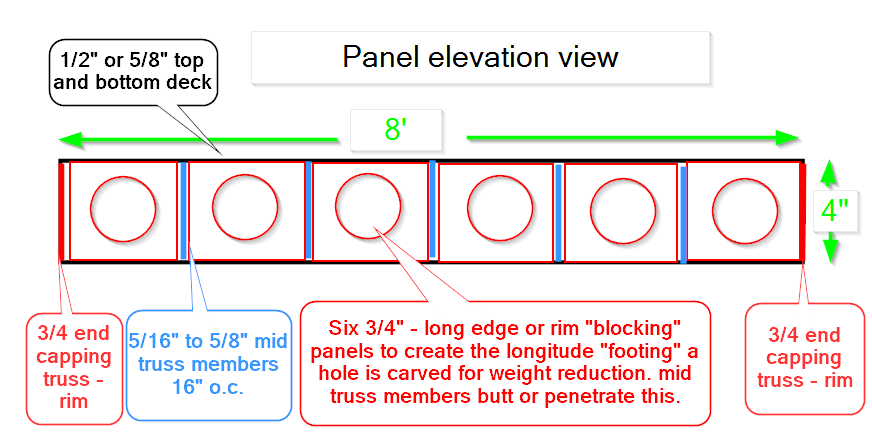
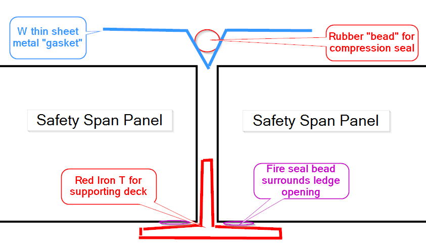

# The SafetySpan Protocol: A Modular TRC Truss System for High-Resilience Dry Construction

**Version:** 1.0.0-Alpha  
**Date:** July 25th 2026
**Author:** John Kirby
**License:** MIT License (Open-Source Structural Protocol)  
**Status:** Defensive Publication for Public Domain / MIT

---

## Table of Contents
* [Abstract](#abstract)
* [System Architecture](#system-architecture)
* [Component Specifications](#component-specifications)
* [The Diagnostic Suite (The Gatekeeper Protocol)](#the-diagnostic-suite)
* [Installation & Logistics](#installation--logistics)
* [Safety & Resilience](#safety--resilience)
* [Code Enforcement & Regulatory Equivalency](#code-enforcement--regulatory-equivalency)
* [Underwriting & Risk Architecture](#underwriting--risk-architecture)
* [Maintenance & Adaptive Reuse](#maintenance--adaptive-reuse)
* [Appendix: Standard Detail Drawings](#appendix)

---

## Abstract

**SafetySpan ends pancaking.**  
For nearly a century, buildings have relied on monolithic concrete slabs — single, massive floor plates that fail the same way they are built: all at once. When a poured slab weakens, cracks, delaminates, or ages invisibly, the failure spreads across the entire floor and the whole slab can drop in a single catastrophic event. This is the physics behind seismic pancaking and the hidden‑aging collapses that continue to threaten mid‑rise structures worldwide.

SafetySpan breaks that chain.

Instead of a monolithic slab, SafetySpan uses independent 4×8 structural TRC modules, each seated in a continuous steel tray. Every panel is a discrete structural unit — a fuse, not a slab. In fire, shock, or seismic events, a compromised panel fails on its own rather than pulling the rest of the floor into collapse. The steel tray catches the load path and keeps the failure contained. Adjacent panels remain seated because they are decoupled by design. SafetySpan transforms collapse behavior from “one floor fails as a single mass” to “one panel fails safely.”

This modular geometry eliminates hidden‑aging pancaking. With no rebar to corrode, no embedded utilities to ignite, no slab moisture to accumulate, and no monolithic bond to silently deteriorate, SafetySpan replaces opaque slab aging with **transparent, inspectable structural health**. Every panel carries a factory‑applied **Witness Lacquer Grid**, revealing micro‑cracks, overstress, improper seating, or transport damage instantly. Inspectors and insurers gain a permanent, non‑destructive diagnostic layer built directly into the structure.

Mechanically, SafetySpan is engineered for extreme events. Its 16" O.C. truss architecture and AR‑glass‑wrapped edges deliver high stiffness with composite ductility. The system’s lightweight, decoupled modules reduce inertial forces during earthquakes, preventing the slab‑wide mass‑movement that causes traditional floors to pancake. In fire scenarios, the discrete modules act as sacrificial fuses: if one panel fails, the failure is contained at the tray, protecting the building’s steel chassis and preventing progressive collapse.

SafetySpan is a **structural infill protocol**, not a product. It decouples the building’s chassis (primary steel) from its deck (modular TRC panels), enabling dry construction, rapid installation, and single‑trade accountability. Ironworkers build the tray, drop in the panels, and create an instant working surface — no curing, no moisture testing, no rebar inspection, no slab demolition during future renovations. Utilities never penetrate the panels; they are suspended from the tray, ensuring full accessibility and eliminating hidden ignition or corrosion vectors.

At 75% less weight than a conventional 4‑inch slab, SafetySpan enables significant downsizing of primary steel and foundations, unlocking new ROI models for mid‑rise construction and preserving older structures that cannot support modern slab loads. The system is engineered for equivalency certification under **ASTM E119**, **ASTM E136**, **UL 263**, and **ACI 549.1R**, with a fire‑resistance ambition of **2‑hour performance** once tested.

SafetySpan is a new collapse geometry, a new inspection regime, and a new underwriting category. It is dry construction with structural transparency. It is modular flooring engineered for the next century — a safer, clearer, lighter, and more resilient alternative to the monolithic slab.

---

## System Architecture

The SafetySpan system is a **Modular Structural Infill Protocol** designed to interface with a variety of skeletal chassis. While the nominal implementation is optimized for a 4'x8' ironwork grid, the architecture is fundamentally scalable and material-agnostic within the defined mechanical parameters.

### Geometric Versatility & Sizing
The protocol defines the panel as a discrete structural unit whose dimensions are limited only by the Modulus of Rupture (MOR) of the chosen material matrix and the logistical constraints of the installation site.
* **Nominal Format:** 4' x 8' (1219mm x 2438mm) for standard commercial bays.
* **Maintenance/Remodel Format:** 4' x 4' or smaller truncated rectangles designed for transport via standard maintenance elevators or through existing window apertures.
* **High-Span Format:** 4' x 12', 4' x 16', or 4' x 24' configurations. These formats are explicitly **subject to MOR and chassis design validation** to ensure serviceability limits are maintained over extended spans.
* **Custom Geometries:** The system supports non-orthogonal shapes (triangles, trapezoids) via water-jet or CNC-machined perimeter truncation to accommodate irregular building footprints.

### Support Grid Ontology
SafetySpan utilizes a "Cradle-and-Infill" logic that maps to existing non-structural grid systems, effectively upgrading their load-bearing capacity to primary structural status **when the grid is specifically engineered for that duty**.
* **Ironwork Chassis:** Primary steel joists fitted with T-beam or L-angle "Trays."
* **Access Floor Analogy:** The system functions as a "Structural Access Floor," where the ironwork grid serves as the **Main Runners** and the panels serve as the **Load-Bearing Tiles**.
* **Ceiling Grid Analogy:** The system mirrors the assembly logic of a **Suspended Tegular Ceiling**, but is defined by **structural bearing instead of acoustic suspension**, allowing the panel's recessed edge to sit flush within a supporting structural grid.

### Material Composition & Matrix
The protocol encourages the use of any cementitious or mineral-based matrix reinforced with non-corrosive ligaments.
* **Standard Matrix:** Fiber-cement (cellulose-reinforced) or GFRC (Glass Fiber Reinforced Concrete).
* **Exotic Reinforcements:** The protocol explicitly includes the use of **Basalt Roving (Lava Glass)**, **304/316 Stainless Steel Mesh**, **Aramid (Kevlar)**, or **Carbon Fiber** textiles.
* **Advanced Implementation Method:** A disclosed exploratory method involves laying bi-axial pre-tensioned webbing (AR-glass, basalt roving, or metallic mesh) directly into the mold during the initial pour. This process creates a monolithic, pre-stressed TRC skin that functions as the top deck, bottom deck, and internal trussing simultaneously, maximizing the MOR-to-weight ratio.

### Variable Thickness & Mass
Weight and thickness are treated as dependent variables based on the specific MOR requirements of the project.
* **Skin Thickness:** Nominal 1/2" to 3/4", but scalable from 1/4" to 2" based on **point-load resistance** requirements.
* **Core Depth:** Nominal 3" to 4", but scalable to 12" or more for high-span industrial or data center "Super-Planks."
* **Total System Weight:** Typically 10–15 lbs/sq. ft., but variable based on the inclusion of Self-Leveling Underlayment (SLU) or internal acoustic damping fills.

### Flexible Footing & Assembly
The longitudinal "Footing" structures (Rim Blocking) that transfer loads to the chassis are not restricted to monolithic construction.
* **Assembly Logic:** Footing structures may be factory-bonded, dovetailed for mechanical interlock, or shipped as discrete components for "Snap-Together" assembly.
* **Interface:** The interface between the internal trusses and the perimeter footing is open to exploration, including mortise-and-tenon joints, fiberglass-welded fillets, or high-expansion chemical bonding to achieve **robust shear transfer within modular panel behavior**.

### Open Material Exploration
The SafetySpan Protocol is a living standard. It is explicitly open to the integration of emerging materials—including geopolymers, carbon-sequestering cements, and bio-resins—to continuously optimize the ratio of **Flexural Strength to Dead Weight**.

---

## Component Specifications

The SafetySpan panel is a modular Mineral Composite Structural Panel (MCSP) defined by performance-based criteria rather than fixed materials, geometries, or manufacturing methods. This section establishes the Reference Build for a standard 4'x8' floor panel and the Performance Equivalency Rules that allow any future material, bonding method, reinforcement system, or web topology to qualify under the protocol. All specifications describe the panel itself as an MCSP, independent of system-level behavior or installation practices.

### Structural Geometry and Web Architecture

**Reference Build:**  
The internal structure consists of load-bearing webs arranged at a nominal spacing of 16 inches On-Center (O.C.). Webs are planar mineral members that transfer shear and flexural stresses between the skins while maintaining the geometric separation required for composite action. 
*Figure 1: Internal rib and rim geometry of the 4'x8' Reference Build.*

**Performance-Based Allowances:**  
Web spacing may vary between 4 and 24 inches On-Center. Web architecture is not restricted to linear layouts; the protocol explicitly discloses variable, clustered, staggered, diagonal, curved, cellular, ribbed, gradient, biomimetic, or hybrid geometries, including those generated through algorithmic, AI-driven, or topology-optimization methods. Web depth, thickness, and profile may vary across the panel. Webs may incorporate optional castellation, perforations, or functional voids and may form a continuous **Structural Plenum** and likely will not be used for utility routing, though if engineer desires it can be, provided vertical load-transfer paths remain structurally continuous. 

### Field Penetration Protocol (Manufacturer Recommendation)

Engineered chases intended for mechanical, electrical, or plumbing routing shall be fully pre-planned during architectural and engineering design so that factory-produced truncated MCSP panels and corresponding engineered ironwork trays can be ordered in quantity. Such chases shall not be created through onsite alterations or penetrations. Factory-produced chase panels shall incorporate designed web terminations, reinforced skin boundaries, and controlled consolidation to ensure structural continuity equivalent to the Reference Build.

Field penetrations are not part of the standard MCSP installation workflow and are not recommended. When unavoidable, penetrations may only be performed under strict geometric and structural constraints to preserve composite behavior and ensure the panel can pass Safety Test Jig verification prior to placement.

Authorized penetrations shall comply with the following limits:  
* Hole diameter shall not exceed one-third of the clear skin span between adjacent webs.  
* No penetration may occur within a 2-inch offset from any internal web, rim block, or reinforced perimeter zone.  
* No more than two penetrations are permitted within any 4-foot bay, with a minimum spacing between holes equal to twice the diameter of the largest penetration.  
* All penetrations must be cut using low-vibration mineral-compatible tooling to prevent delamination at web–skin bond lines.

Each authorized penetration must be circumferentially reinforced using high-tensile mineral roving (basalt or AR-glass) and a structural bonding medium to restore local skin continuity. Reinforcement materials shall fully encapsulate and saturate the roving; dry, exposed, or fuzzy fibers constitute a mandatory rejection condition. All reinforcement materials shall cure to manufacturer-specified structural handling strength prior to Safety Test Jig verification.

Manufacturers may optionally provide factory-applied “green paint” patches indicating pre-authorized cut zones. These patches may include reminders of allowable penetration quantity, diameter limits, required reinforcement, and mandatory jig verification. When penetrations are performed, the worker responsible for the cut and the supervisor approving the jig test should mark the underside of the panel adjacent to the patched penetration with the date, load test weight, time under load, worker name, and approving supervisor name for traceability and inspection compliance. Illegible, missing, or incomplete metadata constitutes a mandatory rejection condition.

Safety Test Jig verification shall simulate the design point load for the specific building type. Inspectors shall confirm that the load test weight recorded on the panel matches the required design reaction forces for the installation. Panels that do not pass jig testing shall not be placed under any circumstance.

### Perimeter Architecture and Dense Edge Zone

**Reference Build:**  
The rim section shall be engineered for the design bearing and reaction forces associated with the intended application, which may exceed the baseline panel MOR requirements. Rim geometry, material density, and reinforcement shall be selected to prevent crushing, shear failure, or local overstress under the maximum factored support loads defined by the structural design.I like tha

**Performance-Based Allowances:**  
The edge zone must distribute reaction forces across a minimum 2-inch structural ledge without localized crushing or punching-shear failure. Larger bearing ledges may be engineered when required by the design reaction forces or support conditions, and such modifications remain within protocol bounds when they preserve rim continuity and composite behavior. Edge densification may be achieved through material density, geometric reinforcement, composite layering, textile reinforcement, post-production rim reinforcement, or hybrid rim systems. Rim geometry may be solid, laminated, composite, mineral, ceramic, basalt, or hybrid configurations, provided equivalent or greater bearing strength is achieved.

### Material Matrix (Skins and Core)

**Reference Build:**  
The panel utilizes reinforced mineral skins bonded to a hollow or semi-hollow mineral core. Skin thickness is determined by engineering analysis of design loads, span conditions, and serviceability limits.

**Performance-Based Allowances:**  
Skins may be composed of fiber-cement, GFRC, magnesium-cement, geopolymer, ceramic composite, basalt-reinforced mineral plate, carbon-reinforced mineral plate, hybrid mineral composites, or nano-reinforced mineral plates meeting MOR and fire-rating requirements. Skin thickness may be symmetric or asymmetric and may vary across the panel. Core architecture may be hollow, semi-hollow, cellular, foamed, ribbed, composite, or topology-optimized. Core materials may include mineral composites, geopolymer foams, ceramic foams, basalt-foam hybrids, mineral wool, or future mineral matrices capable of maintaining skin separation under load.

### Bonding, Reinforcement, and Consolidation

**Reference Build:**  
The panel employs a **post-production monocoque edge wrap** of continuous basalt woven roving to provide torsional toughness and prevent skin-peel at the boundaries. Skins and the core are bonded using a structural adhesive selected for interlaminar shear performance. Consolidation is achieved through vacuum-assisted assembly.

**Performance-Based Allowances:**  
Bonding may be achieved through chemical adhesives, mineral binders, ceramic adhesives, silicate binders, geopolymer binders, magnesium binders, bio-resins, carbon-nanotube adhesives, pressure-sintered interfaces, thermal-fused mineral interfaces, cold-weld mineral interfaces, mineral fusion methods, or mechanical interlocks. Reinforcement may utilize basalt, AR-glass, carbon fiber, aramid, ceramic fiber, mineral tape, nano-textile reinforcement, or hybrid composites. Consolidation may be achieved through mechanical pressing, clamp/roller consolidation, gravity cure, thermal cure, chemical cross-linking, mineral sintering, or pressureless bonding, provided a void-free bond is produced

---

## The Diagnostic Suite (The Gatekeeper Protocol)

The SafetySpan protocol replaces the "Black Box" of traditional monolithic construction with a transparent, inspectable structural regime. By baking structural gatekeeping directly into the material matrix and the assembly sequence, SafetySpan transforms the floor from a passive surface into an active diagnostic asset. This section defines the **Verification Layer**—a suite of visual, digital, and forensic gates that allow code enforcement officials and insurance underwriters to certify structural health without specialized expertise or destructive testing.

### The Unified Red Diagnostic Grid
The primary material diagnostic is a factory-applied grid of 1-inch (25mm) wide stripes composed of **Red Brittle Lacquer** (e.g., Stresscoat or equivalent). This grid serves as a permanent, non-destructive structural logbook on the underside of every Mineral Composite Structural Panel (MCSP).

* **Calibration:** The lacquer must be formulated to craze (spiderweb) at **75% of the material’s Modulus of Rupture (MOR)**. This ensures that any overstress event is recorded before the panel reaches its ultimate failure limit.
* **Dual-Mode Monitoring:**
    * **Seating Health:** Perimeter grid lines monitor shear strain at the support interface. Crazing in these zones indicates localized edge-crushing or point-loading due to uneven ironwork.
    * **Flexural Health:** Internal grid lines monitor mid-span deflection. Crazing in these zones indicates construction-phase abuse, accidental shock-loading, or seismic strain.
* **Gatekeeper Protocol:** A "Healthy" panel shows a smooth, continuous grid. A "Flagged" panel shows visible crazing and must be rejected or replaced via the "Pop and Swap" maneuver.

### The 1/4-inch Inspection Reveal
To enable high-speed code enforcement, the protocol utilizes a 1/4-inch (6.35mm) unpainted **Inspection Reveal** (Safety Gap) of raw cementitious board between the steel support ledge and the start of the Red Diagnostic Grid.

* **Binary Seating Check:** 
    * **Pass:** The inspector observes a uniform 1/4" gap of raw board between the ironwork and the paint.
    * **Fail (Under-Seated):** The inspector observes >1/4" of raw board, indicating the panel has not reached its minimum structural bearing depth.
    * **Fail (Over-Seated):** The inspector observes no raw board (paint is obscured by the steel), indicating potential grid-alignment errors or "binding" that could impede thermal expansion.
* **Bond Integrity:** Leaving the bearing surface raw ensures the **Ductile Ledge Gasket** achieves a clean, high-tack bond to the mineral pores, unhindered by the brittle lacquer.

### Optical Clear-Path Verification (The Digital Gate)
Optical Clear-Path Verification is a mandatory **Regulatory Gate** performed prior to panel placement. Optical Clear-Path Verification confirms that the ironwork chassis is within the co-planarity tolerances required for rigid MCSP seating.

* **The Ledge Witness Jig:** The Ledge Witness Jig is a lightweight aluminum frame constructed from angle or box section members. The jig is dropped directly onto the ironwork ledge and features a built-in **Witness Band** consisting of three horizontal zones:
    * **Upper Reflective Strip:** Indicates a "LOW" ledge condition.
    * **Center Matte Strip:** Indicates the "PASS" condition (Design Elevation).
    * **Lower Reflective Strip:** Indicates a "HIGH" ledge condition.
* **The Level Datum Rule:** The rotating laser must establish an earth-horizontal level plane referenced to the building’s established structural datum. The level plane established by the laser must remain unchanged for the duration of the sweep.
* **The Benchmarking Rule:** Each bay sweep must begin by referencing a fixed benchmark, such as a building column mark or a previously certified ledge.
* **The "Flash = Fail" Logic:** 
    * **Pass:** A "Pass" occurs when the laser strikes only the matte strip, confirming the ledge is level and co-planar with the benchmark plane.
    * **Fail:** The laser strikes a reflective strip, producing a visible "Flash." A flash on the lower strip indicates the steel is intruding upward; a flash on the upper strip indicates the steel is sitting too low.
* **Remedy and Marking Protocol:** Upon any failure, the operator must mark the exact segment on the ledge with the required correction: **"HIGH — grind down"** or **"LOW — shim/adjust."** The full 360° sweep must be repeated until a "No-Flash" pass is achieved.
* **Verification Guardrail:** Dry-fit is an optional secondary verification method and must never override laser-based certification.

### Forensic Documentation and Chain of Custody
To satisfy underwriting requirements, every verified structural bay must generate a permanent forensic record.

* **Construction Log:** The operator must complete a three-item binary checklist for every bay:
    1. Laser jig calibrated to level datum and benchmark: YES/NO
    2. Full 360° rotation sweep completed: YES/NO
    3. No beam contact/reflective flash observed: YES/NO
* **Physical Sign-off:** Upon a final pass, the laser operator must sign and date the red iron or a wire tag tied to the ledge. This signature must match the corresponding entry in the Construction Log.
* **Photo Log:** A minimum of two photos per direction are required:
    1. One photo showing the laser plane hitting the matte strip of the jig.
    2. One photo showing the operator's signature and date on the ironwork.
* **Data Integrity:** These photos serve as a static digital record of the verified structural state. Missing, incomplete, or illegible metadata/logs constitute a mandatory rejection condition for the bay.

---

## Installation & Logistics (Dry Build Protocol)

This section defines the field execution of the SafetySpan protocol. By replacing on-site chemistry with factory physics, the system enables a "Dry Build" sequence that eliminates the logistical and financial bottlenecks associated with traditional reinforced concrete.

### Logistical Efficiency and Financial De-risking
SafetySpan is engineered to maximize shipping density and eliminate the "Chemical Lottery" of wet trades.
* **The 6-to-1 Advantage:** A single 53-foot flatbed carries approximately 125 MCSP panels (4,000 sq. ft.). For a typical 20,000 sq. ft. floor plate, SafetySpan requires only **5 flatbed deliveries** compared to the **30+ concrete mixer trucks** and pumping rig required for a traditional pour.
* **Elimination of Schedule Volatility:** The protocol removes the need for on-site batching, rebar shoring, and 28-day cure windows. 
* **Bank Risk Mitigation:** By eliminating "Hot Loads" (delayed concrete) and rejected slump tests, SafetySpan reduces the risk of cascading schedule delays that can trigger interest penalties or construction loan draw-down failures.

### Site Initiation and the Suspended Ground Floor
The SafetySpan building begins with a "Suspended Ground Floor" doctrine, treating the earth as a variable rather than a constraint.
* **Geotech Requirement (Job #1):** Proper pier depth and coring tests are paramount. The protocol mandates strict adherence to geotechnical piling/caisson specs to prevent differential settlement, as the rigid structural chassis (steel or concrete ledges) does not tolerate **dimensional compromise**.
* **Reduced Site-Prep Burden:** Because the structural plane is defined by the steel chassis, mass grading, expensive select-fill import (typically 3'–6' depending on jurisdiction), and nuclear density testing of compacted lifts are eliminated beneath the building footprint.
* **Freeboard and Flood Resilience:** The first deck is elevated to provide a service walk-space and flood mitigation. The freeboard height (typically 3'–15') is a variable determined by the building owner and underwriters based on site-specific flood risk. 
* **Soft-Story Mitigation:** High-freeboard designs (>5') require shear walls or reinforced grade beams tying the pilings together to prevent **soft-story drift** and ensure chassis rigidity.

### Systemic Redundancy Best Practices
To enhance the non-progressive collapse behavior and fire safety of the structure, the following architectural strategies are recommended:
* **Grid Rotation and Offset:** Architects and engineers should consider rotating the ironwork grid 90 degrees or offsetting it by 1/2 bay between adjacent floors. This ensures that flexural mid-spans never align vertically, mathematically reducing the probability of multi-floor impact failure.
* **Staggered MEP Chases:** Engineered utility chases should be offset or staggered between floors. This prevents a "straight-drop" chimney effect during fire events and ensures that dropped objects cannot travel unimpeded from the upper floors to the lobby.

### Hoisting and Vertical Access
* **Primary Hoist:** Side-mounted construction hoists are the primary vertical path for panels. 
* **Crane Picks:** When using cranes, **Spreader Bars** are mandatory to ensure vertical lift and prevent "Sling Pinch" damage to the panel edges.
* **Service Elevator Future-Proofing:** All SafetySpan buildings must feature at least one service elevator sized to accommodate a standard 4'x8' panel to ensure the "Pop and Swap" lifecycle remains viable for the life of the structure.
* **Landing Cadence:** The sequence is: Bay Certification → Panel Landing → Spline Installation. The deck is functionally complete and walkable the moment the panels are seated.

### Certified Mock Bay and Field Validation
Prior to full-scale decking, a **Certified Mock Bay** must be constructed to full specification.
* **Training and Sign-off:** The mock bay serves as the standard for ironworker training and inspector sign-off on the "Laser Ledge Protocol."
* **On-site Safety Test Jig:** The mock bay functions as the validation point for any field-modified panels. 
* **Testing Protocol:** All destructive or proof-load testing of factory or field-modified panels must be **video-documented** to preserve warranty and manufacturer review integrity. Panels passing proof-load testing without further crazing of the diagnostic grid may be reinstalled.

### Ledge Preparation and the Ductile Interface
* **The Controlled Bond-Line:** Panels are seated on a pre-formed, high-flow, low-shore ductile gasket (Intumescent Butyl). This creates a **smoke-tight plug** to assist with the assembly's fire rating.
* **Bead Geometry:** The gasket must be **tube or roll-shaped** (not flat tape) to ensure uniform compression and prevent "corner heave" when turned 90 degrees at the bay corners.
* **Poka-yoke Application:** The gasket is supplied in pre-cut 24-foot rolls on wax paper. This ensures exactly one roll per bay, providing a visual "Trash Bin Audit" for inspectors to verify seal continuity.
* **Point-Load Mitigation:** The ductile gasket absorbs minor weld burrs and beam twists, ensuring 100% surface contact even when the bay has passed the laser-level gate.

### Sealing and Mechanical Lock-in
* **Mechanical Lock-in:** Horizontal joints are sealed with a hybrid metal/rubber W-Gasket (Structural Spline). The rubber bead is rolled into the "V," wedging the metal wings against panel edges to create lateral tension. 

*Figure 2: Tray seating and adjacent mating.*

* **The Safety Cross:** Intersections are sealed with Red Intumescent Fire Caulk. This creates a smoke-tight plug that is visually obvious as a "Safety Cross" for rapid inspector sign-off.

### Wall Creation and Vertical Interfaces
To maintain the "Pop and Swap" serviceability of the deck, partitions must follow the **Floating Partition Protocol**.
* **Bottom Connection:** The wall's bottom plate is bonded to the MCSP skin using structural construction adhesive and reinforced with AR-glass tabbing. Where walls align with panel gaps, they may be flanged directly to the steel T-beam stem.
* **Top Connection:** The top of the partition utilizes **conventional commercial slip-tracks** affixed to the structural chassis above. This allows the wall to be laterally locked but vertically floating, accommodating thermal/seismic movement and allowing floor panels to be removed without demolishing the wall.

### MEP Integration and "The Panel Bank"
* **No Buried Assets:** Primary utilities (except pre-planned drains) are relegated to dedicated MEP chases or suspended from the ironwork grid using over-the-beam straps.
* **The Panel Bank:** Completed buildings should maintain a minimal inventory of **1–3 spare panels total**; additional units should be ordered only when remodel work is scheduled.
* **Hybrid Wet-Zones:** For high-density penetrations (e.g., bathrooms), truncated MCSP panels may be paired with fabricated steel or wood infill plates. Fabricated infill plates shall serve as the **primary carriers for penetrations**, with truncated MCSP modules maintaining structural adjacency.

### Commissioning and Acceptance KPIs
To quantify the "Elon-speed" advantage, the following KPIs shall be recorded:
* **Bay Cycle Time:** Time from laser certification to final spline lock.
* **Hoisting Efficiency:** Panels installed per crane/hoist hour.
* **Ledge Remediation Rate:** Percentage of bays requiring corrective ledge adjustment prior to panel seating.
* **Diagnostic Pass Rate:** Percentage of panels installed without witness-mesh activation or visible crazing.

---

## Safety & Resilience

The SafetySpan protocol shifts the structural paradigm from "Resilience through Mass" to "Resilience by Design." By utilizing a kinetic, modular architecture instead of a static, monolithic one, the system provides a superior safety envelope for extreme events. This section defines the mechanical behavior of the structure under fire, seismic, and environmental stress.

### Non-Progressive Collapse (The Structural Fuse Doctrine)
SafetySpan replaces the continuous monolithic slab with decoupled 4'x8' structural modules. This modularity transforms the building’s failure mode from a system-wide catastrophe to a localized event.
* **The Structural Fuse:** In the event of a catastrophic impact or localized overload, a compromised panel acts as a "fuse," failing individually within its structural chassis. 
* **Shock-Load Mitigation:** Because the panels are discrete units, the failure of one module does not "unzip" the rest of the floor. In a catastrophic drop, the 400-lb mass of a single panel **significantly reduces the dynamic shock load** on the floor below compared to the multi-ton impact of a failing concrete slab. This allows the ironwork chassis to function as an **impact-damping structural cradle**, arresting the drop and preventing progressive collapse.

### Fire Compartmentalization and Environmental Barrier
The system utilizes a "Double-Hull" fire and smoke defense strategy that treats every 4'x8' bay as a discrete environmental compartment.
* **The Double-Hull Seal:** The combination of the ductile ledge gasket (Layer 1) and the hybrid W-gasket spline with Red Fire-Corner caulk (Layer 2) creates a smoke-tight, flame-resistant barrier.
* **Chimney Effect and Mold Mitigation:** By sealing the inter-panel gaps, the protocol eliminates the "chimney effect"—the vertical migration of toxic gases. Crucially, this same compartmentalization **inhibits black mold propagation** between floors, as spores and moisture-laden air cannot bypass the sealed ledge and spline interfaces.
* **Internal Water Containment:** The sealed nature of the assembly ensures that internal flooding (e.g., from fire suppression sprinklers or kitchen leaks) is mitigated from reaching the floors below. This reduces the likelihood of **hidden moisture reservoirs**, preventing mold colonization in concealed cavities and reducing secondary damage claims.

### Seismic Inertia and Energy Dissipation
SafetySpan leverages the physics of mass reduction and ductility to protect the building’s skeletal chassis during seismic disruption.
* **Inertial Reduction ($F=ma$):** By reducing the floor mass by 75%, the building generates significantly less lateral force during an earthquake. This lower inertial demand reduces the stress on every column, connection, and foundation.
* **Kinetic Chassis:** Unlike a brittle concrete monument that "fights and cracks," the SafetySpan system is a kinetic assembly. The steel frame provides ductility, while the decoupled panels can shift microscopically within their cradles. SafetySpan **dissipates energy through controlled micro-movement**, whereas monolithic concrete stores energy and releases it catastrophically through slab-wide fractures.

### Flood Resilience and Hydrostatic Relief
The "Suspended Ground Floor" doctrine decouples the building’s primary deck from the destructive forces of the earth.
* **Hydrostatic Pressure Avoidance:** High freeboard (3'–15') allows floodwaters to pass beneath the structure. This prevents the buildup of hydrostatic pressure that typically shatters ground-bearing slabs.
* **Moisture Entrapment Avoidance:** Because the protocol enforces a "No Buried Assets" rule, the system avoids the moisture entrapment that typically leads to mold blooms in buried conduits and slab cavities.
* **Rapid Recovery:** Following a flood event, the building can be inspected, cleaned, and restored to service with minimal downtime. The visibility of all plenums allows inspectors to identify moisture-driven risks immediately, ensuring a safe and rapid return to occupancy.

### Diagnostic Transparency (The Recovery Path)
SafetySpan is the first structural system designed to "self-report" its health following a disaster, providing a verifiable path to re-occupancy.
* **Forensic Verification:** The **Witness Mesh** (Brittle Lacquer) and **Red Line** seating provide instant, non-destructive proof of structural state. Inspectors can walk the plenums and visually confirm if a bay has been overstressed or if a panel has shifted.
* **The Insurance Dividend:** This transparency eliminates the need for core-drilling, X-raying, or slab-scanning after a seismic or fire event. By providing a clear "Standard of Proof," SafetySpan drastically reduces the duration of post-event inspections and the associated "Business Interruption" costs.
